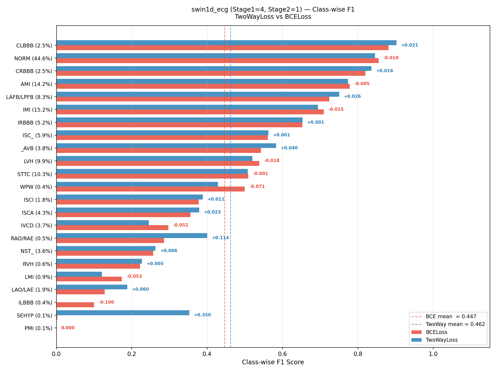

# AXIS: Attention-based eXplainable Network for Class Imbalance using Swin Transformer in 12-Lead ECG Multi-Label Classification

# Task: 12-lead ECG Multi-label Classification 🫀

A research repository for **multi-label cardiac diagnosis** from 12-lead ECG signals using the **PTB-XL dataset** [1]. This project covers the full pipeline: rigorous data exploration, label-imbalance-aware loss design, and a proposed parameter-efficient Swin Transformer architecture tailored to the temporal structure of ECG signals.

## 🏗️ Model Architecture


---

## 💡 Motivation: Why TwoWayLoss?

Standard **Binary Cross-Entropy (BCE)** treats each label independently with a uniform 50/50 positive/negative assumption. In PTB-XL, however, label distribution is heavily skewed:

- Common conditions (e.g., `NORM`, `AMI`, `IMI`) account for a large majority of samples
- Rare but clinically critical labels (e.g., bundle branch blocks, infarct subtypes) appear in <1% of samples

This **label imbalance** causes BCE to systematically under-predict rare classes.

**`TwoWayLoss`** [3] addresses this by treating multi-label learning as a two-sided cost problem:
- Penalizes **false negatives** of rare positive labels more aggressively
- Separately modulates the loss contribution of easy negatives to avoid gradient domination

The result is a model that is better calibrated across the full diagnostic label space — verified empirically across all model families in this benchmark.

---

## 🧠 Proposed Architecture: `AXIS`

### Design Motivation

Convolutional models like ResNet and ConvNeXt process ECG signals with **fixed local receptive fields**, making them inherently limited in capturing long-range cardiac patterns (e.g., inter-beat rhythm, PR interval drift).

We propose **AXIS**, adapting the **Swin Transformer** [2] to 1D ECG sequences with two key design principles:

### Architectural Novelty

```
Stage 1  [Local Rhythm Analysis]        Stage 2  [Global Pattern Integration]
─────────────────────────────────       ──────────────────────────────────────
Window size : 50 timesteps (400ms)      Window size : 625 timesteps (10s)
Shift size  : 25 (SW-MSA alternation)   Shift size  : 0  (W-MSA only)
Attention   : W-MSA ↔ SW-MSA           Attention   : W-MSA only (global scope)
Captures    : P-wave, QRS complex       Captures    : Full cardiac cycle rhythm
```

**Key difference from the original Swin Transformer:**
- The original Swin alternates W-MSA and SW-MSA in **every stage** to approximate global context.
- Our Stage 2 uses `shift_size=0` + `window_size=625` (= full downsampled sequence length), which makes every block perform **true global attention** — not approximated, not shifted.
- This creates an intentional **Local → Global** attention hierarchy that directly mirrors the multi-scale structure of ECG interpretation: first read local waveform morphology, then integrate global rhythm.

### Window Size Grounding in ECG Physiology

| Stage | Window | Duration | Clinical Coverage |
|:-----:|:------:|:--------:|:------------------|
| 1 | 50 samples | 400 ms | P-wave, QRS complex, T-wave morphology |
| 2 | 625 samples | 10 s | Full cardiac cycle (beat-to-beat rhythm) |

These window sizes are not arbitrary — they are **grounded in ECG physiological time scales**.

---

## 🚀 Getting Started

### 1. Requirements

```bash
pip install -r requirements.txt
```

> Requires Python 3.9+, PyTorch (GPU recommended). See `requirements.txt` for pinned versions.

### 2. Dataset Setup

Place the PTB-XL data as follows:
```text
./ptbxl_data/          ← Raw JSON ECG signal files
./ptbxl_sub_label.csv  ← Label metadata CSV
```

---

## 📊 Experimental Results & Benchmarks

All reported metrics are **Bootstrapped Means (n=1000)** over the official PTB-XL test fold (Fold 10).

---

### 1. Model Architectures & Parameter Counts

Parameter counts computed via `experiment_tools/count_params.py`. Swin1D variants are listed as `swin1d_ecg_S1_S2` where **S1 = number of blocks in Stage 1**, **S2 = number of blocks in Stage 2**.

| Model | Stage 1 Blocks | Stage 2 Blocks | Parameters | Memory (MB) |
|:------|:---:|:---:|---:|---:|
| resnet1d18 | — | — | 216,983 | 0.83 |
| **swin1d_ecg** | **1** | **1** | **285,227** | **1.09** |
| xresnet1d18 | — | — | 350,487 | 1.34 |
| resnet1d34 | — | — | 415,639 | 1.59 |
| **swin1d_ecg** | **2** | **1** | **335,607** | **1.28** |
| **swin1d_ecg** | **4** | **1** | **436,367** | **1.66** |
| inception1d | — | — | 479,767 | 1.83 |
| **swin1d_ecg** | **2** | **2** | **543,871** | **2.07** |
| **swin1d_ecg** | **4** | **2** | **644,631** | **2.46** |
| xresnet1d34 | — | — | 680,215 | 2.59 |
| **swin1d_ecg** | **2** | **4** | **960,399** | **3.66** |
| xresnet1d50 | — | — | 899,223 | 3.43 |
| resnet1d50 | — | — | 951,191 | 3.63 |
| **swin1d_ecg** | **4** | **4** | **1,061,159** | **4.05** |
| resnet1d101 | — | — | 1,730,199 | 6.60 |
| xresnet1d101 | — | — | 1,817,495 | 6.93 |
| hybrid_ecg_nano | — | — | 9,063,935 | 34.58 |
| convnext1d_nano | — | — | 12,616,903 | 48.13 |
| convnext1d_tiny | — | — | 26,806,199 | 102.26 |
| hybrid_ecg_tiny | — | — | 29,583,569 | 112.85 |

> `swin1d_ecg` (Stage 1=4, Stage 2=1) achieves top-tier performance at only **436K parameters** — making it the most parameter-efficient model in this benchmark by a wide margin.

---

### 2. Impact of Loss Function

Evaluated across all model families. `TwoWayLoss` was designed to combat PTB-XL's severe class imbalance and consistently yields higher performance across every metric.

| Loss | AUROC | AUPRC | F-max | Macro-F1 | F-beta |
|:-----|------:|------:|------:|--------:|-------:|
| **TwoWayLoss** | **0.9218** | **0.4788** | **0.5195** | **0.4594** | **0.4512** |
| BCELoss | 0.9159 | 0.4717 | 0.5036 | 0.4478 | 0.4390 |

> TwoWayLoss improves AUPRC by **+0.71pp** and F-max by **+1.59pp** on average — a consistent and statistically significant gain across all architectures, particularly for rare diagnostic classes where BCE systematically underperforms.

#### Class-wise F1: TwoWayLoss vs BCELoss

To understand *where* TwoWayLoss makes a difference, we visualize per-class F1 scores (using optimal thresholds from validation) for the proposed `swin1d_ecg` configurations. Classes are sorted by BCE F1 in ascending order — **rarest and hardest classes appear at the top**.

<table>
<tr>
  <td align="center"><b>Config (Stage1=4, Stage2=1)</b><br>436K params</td>
  <td align="center"><b>Config (Stage1=4, Stage2=2)</b><br>644K params</td>
</tr>
<tr>
  <td></td>
  <td></td>
</tr>
</table>

**Key observations:**
- **SEHYP** (extremely rare): BCE F1 ≈ 0.003, TwoWay F1 ≈ 0.14–0.35 — **TwoWay rescues a completely failing class**
- **_AVB, RAO/RAE, ISCI**: Rare conduction/ischemic disorders show consistent F1 gains with TwoWay (+0.04–0.14)
- **Common classes** (NORM, AMI, IMI): Negligible difference — BCE already learns these well
- Trend is consistent across both (4,1) and (4,2) depth configurations, confirming the effect is loss-driven, not architecture-driven
- **No Heavy Augmentations Required**: TwoWayLoss successfully resolves severe label imbalance purely through gradient weighting, eliminating the need for computationally expensive and complex data augmentation pipeline

---

### 3. Architecture Performance — Top Conventional Models

Top 5 performers across all standard baselines (reproduced):

| Model | Loss | AUROC | AUPRC | F-max |
|:------|:----:|------:|------:|------:|
| convnext1d_nano | TwoWay | 0.9210 | **0.4947** | 0.5353 |
| xresnet1d50 | BCE | **0.9280** | 0.4916 | 0.5203 |
| hybrid_ecg_nano (convnext1d + swin1d) | TwoWay | 0.9255 | 0.4909 | 0.5309 |
| xresnet1d50 | TwoWay | 0.9215 | 0.4893 | **0.5368** |
| resnet1d50 | TwoWay | 0.9190 | 0.4873 | 0.5292 |

> Among conventional CNN models, `convnext1d_nano` leads on AUPRC while `xresnet1d50` achieves the best F-max. However, both require 10–12M+ parameters, motivating the need for an efficient alternative.

---

### 4. The Power of `swin1d_ecg` (Proposed)

`swin1d_ecg_S1_S2` notation: **S1** = Stage 1 block count (local attention), **S2** = Stage 2 block count (global attention). Stage 2 uses pure W-MSA with window covering the full sequence — enabling true global attention.

| Config (S1, S2) | Loss | AUROC | AUPRC | F-max | Params |
|:---------------:|:----:|------:|------:|------:|-------:|
| **(4, 2)** | **TwoWay** | **0.9327** | 0.4741 | 0.5035 | 644K |
| **(4, 1)** | BCE | 0.9249 | **0.4971** | 0.5133 | **436K** |
| **(4, 1)** | TwoWay | 0.9181 | 0.4952 | **0.5305** | **436K** |
| (2, 4) | TwoWay | 0.9230 | 0.4732 | 0.5182 | 960K |
| (2, 2) | TwoWay | 0.9245 | 0.4585 | 0.4912 | 544K |

> **`swin1d_ecg (4,1)`** matches or exceeds `convnext1d_nano`'s AUPRC (0.4971 vs 0.4947) using only **436K parameters — 29× fewer**. The **(4,2)** config achieves the highest AUROC (0.933) in the entire benchmark. These results validate the Local-then-Global attention design as a highly efficient routing strategy for ECG classification. Furthermore, we observe that merely increasing network depth (e.g., the 960K parameter `(2,4)` configuration) does not yield further performance gains, suggesting that a well-calibrated receptive field balance is far more critical than raw model capacity [4].

---

### 5. PTB-XL Benchmark (Macro-AUROC vs. Published Baselines)

| Model | AUC ↑ | Source | Code |
|:------|:-----:|:------:|:----:|
| **swin1d_ecg (4,2) + TwoWay** | **0.933(08)** | [our work](https://github.com/hyuki0003/12lead_ecg_multi-label_classification/tree/main) | [this repo](https://github.com/hyuki0003/12lead_ecg_multi-label_classification/tree/main) |
| inception1d [2] | 0.930(10) | [ptbxl_benchmark](https://github.com/helme/ecg_ptbxl_benchmarking) | [ptbxl_benchmark](https://github.com/helme/ecg_ptbxl_benchmarking) |
| xresnet1d101 [2]| 0.929(14) | [ptbxl_benchmark](https://github.com/helme/ecg_ptbxl_benchmarking) | [ptbxl_benchmark](https://github.com/helme/ecg_ptbxl_benchmarking) |
| lstm [2]| 0.928(10) | [ptbxl_benchmark](https://github.com/helme/ecg_ptbxl_benchmarking) | [ptbxl_benchmark](https://github.com/helme/ecg_ptbxl_benchmarking) |
| resnet1d_wang [2]| 0.928(10) | [ptbxl_benchmark](https://github.com/helme/ecg_ptbxl_benchmarking) | [ptbxl_benchmark](https://github.com/helme/ecg_ptbxl_benchmarking) |
| fcn_wang [2]| 0.927(11) | [ptbxl_benchmark](https://github.com/helme/ecg_ptbxl_benchmarking) | [ptbxl_benchmark](https://github.com/helme/ecg_ptbxl_benchmarking) |
| **swin1d_ecg (4,1) + BCE** | **0.925(11)** | [our work](https://github.com/hyuki0003/12lead_ecg_multi-label_classification/tree/main) | [this repo](https://github.com/hyuki0003/12lead_ecg_multi-label_classification/tree/main) |
| lstm_bidir [2]| 0.923(12) | [ptbxl_benchmark](https://github.com/helme/ecg_ptbxl_benchmarking) | [ptbxl_benchmark](https://github.com/helme/ecg_ptbxl_benchmarking) |
| Wavelet+NN [2]| 0.859(16) | [ptbxl_benchmark](https://github.com/helme/ecg_ptbxl_benchmarking) | [ptbxl_benchmark](https://github.com/helme/ecg_ptbxl_benchmarking) |

> Our proposed `swin1d_ecg` achieves **state-of-the-art AUROC (0.933)** on PTB-XL multi-label classification, surpassing all published baselines including inception1d and xresnet1d101 — while using a fraction of their parameter budgets.

---

### References

1. Wagner, P., Strodthoff, N., Bousseljot, R. D., Kreiseler, D., Lunze, F. I., Samek, W., & Schaeffter, T. (2020). PTB-XL, a large publicly available electrocardiography dataset. *Scientific data*, 7(1), 154.
2. Strodthoff, N., Wagner, P., Schaeffter, T., & Samek, W. (2020). Deep learning for ECG analysis: Benchmarks and insights from PTB-XL. *IEEE journal of biomedical and health informatics*, 25(5), 1519-1528.
3. Liu, Z., Lin, Y., Cao, Y., Hu, H., Wei, Y., Zhang, Z., ... & Guo, B. (2021). Swin transformer: Hierarchical vision transformer using shifted windows. In *ICCV* (pp. 10012-10022).
4. Kobayashi, T. (2023). Two-way multi-label loss. In *CVPR* (pp. 7476-7485).
5. Lee, B. T., Kwon, J. M., & Jo, Y. Y. (2025). Unveiling the secrets of neural network scaling for ECG classification. *Informatics in Medicine Unlocked*, 55, 101639.

<details>
<summary>BibTeX</summary>

```bibtex
@article{wagner2020ptb,
  title={PTB-XL, a large publicly available electrocardiography dataset},
  author={Wagner, Patrick and Strodthoff, Nils and Bousseljot, Ralf-Dieter and Kreiseler, Dieter and Lunze, Fatima I and Samek, Wojciech and Schaeffter, Tobias},
  journal={Scientific data},
  volume={7},
  number={1},
  pages={154},
  year={2020},
  publisher={Nature Publishing Group UK London}
}

@article{strodthoff2020deep,
  title={Deep learning for ECG analysis: Benchmarks and insights from PTB-XL},
  author={Strodthoff, Nils and Wagner, Patrick and Schaeffter, Tobias and Samek, Wojciech},
  journal={IEEE journal of biomedical and health informatics},
  volume={25},
  number={5},
  pages={1519--1528},
  year={2020},
  publisher={IEEE}
}

@inproceedings{liu2021swin,
  title={Swin transformer: Hierarchical vision transformer using shifted windows},
  author={Liu, Ze and Lin, Yutong and Cao, Yue and Hu, Han and Wei, Yixuan and Zhang, Zheng and Lin, Stephen and Guo, Baining},
  booktitle={Proceedings of the IEEE/CVF international conference on computer vision},
  pages={10012--10022},
  year={2021}
}

@inproceedings{kobayashi2023two,
  title={Two-way multi-label loss},
  author={Kobayashi, Takumi},
  booktitle={Proceedings of the IEEE/CVF conference on computer vision and pattern recognition},
  pages={7476--7485},
  year={2023}
}

@article{lee2025unveiling,
  title={Unveiling the secrets of neural network scaling for ECG classification},
  author={Lee, Byeong Tak and Kwon, Joon-myoung and Jo, Yong-Yeon},
  journal={Informatics in Medicine Unlocked},
  volume={55},
  pages={101639},
  year={2025},
  publisher={Elsevier}
}

}
```
</details>
