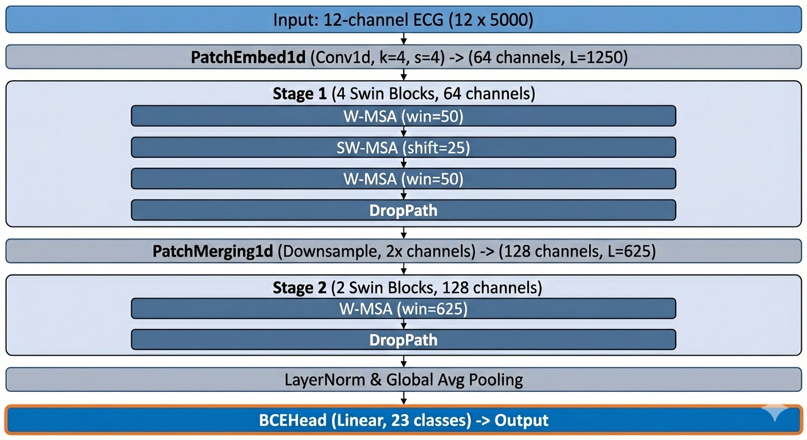

# AXIS

## Status

| Item | Status |
|---|---|
| Research | BSPC submission planned · September 8, 2026 |
| Implementation | Model and loss available; standalone training and checkpoints: **To be uploaded** |

**A compact local-then-global one-dimensional Swin transformer with a two-way multi-label loss for long-tailed 12-lead ECG diagnosis**

Dae Hyeon Kim and Dong-Hyuk Lee (equal contribution), Young-Seok Choi.

Submission to *Biomedical Signal Processing and Control* planned for September 8, 2026. Model and loss implementations are included in this repository.

## Architecture

AXIS processes 10-second, 12-lead ECGs with two attention stages. A patch size of four converts 5,000 samples per lead into 1,250 tokens. Local shifted windows cover 50 tokens (400 ms). Patch merging reduces the sequence to 625 tokens, which fit within one global attention window. The two-way multi-label loss compares positive and negative logits along both sample and class dimensions.

| Component | Configuration |
|---|---|
| Input | 12 leads × 5,000 samples; 500 Hz |
| Patch embedding | Patch size 4; embedding dimension 64 |
| Local attention | Window 50; shift 25; 4 heads |
| Global attention | Window 625; shift 0; 8 heads |
| Default stage depths | 4 local blocks, 2 global blocks |
| Output | 23 PTB-XL sub-diagnostic statements |

## Results

PTB-XL test fold 10; bootstrap means over 1,000 resamples. `(L, G)` denotes local and global block counts.

| Model | Loss | Parameters | Macro AUROC | Macro AUPRC | F-max |
|---|---|---:|---:|---:|---:|
| convnext1d_nano | Two-way | 12,616,903 | 0.9210 | 0.4947 | 0.5353 |
| xresnet1d50 | BCE | 899,223 | 0.9280 | 0.4916 | 0.5203 |
| AXIS (4, 1) | BCE | 436,367 | 0.9249 | 0.4971 | 0.5133 |
| AXIS (4, 1) | Two-way | 436,367 | 0.9181 | 0.4952 | 0.5305 |
| AXIS (4, 2) | Two-way | 644,631 | 0.9327 | 0.4741 | 0.5035 |
| AXIS (2, 2) | Two-way | 543,871 | 0.9245 | 0.4585 | 0.4912 |

The (4, 2) configuration has the highest AUROC among these AXIS configurations. The (4, 1) configuration retains higher AUPRC. Under (4, 1), the two-way loss increases F-max relative to BCE while reducing AUROC and AUPRC.

## Implementation

| File | Contents |
|---|---|
| [model/lg_ecg.py](model/lg_ecg.py) | Patch embedding, shifted-window attention, patch merging, `SwinTransformer1d`, and `get_swin1d_ecg` |
| [losses/TwoWayLoss.py](losses/TwoWayLoss.py) | Two-way multi-label loss in PyTorch |
| [requirements.txt](requirements.txt) | Recorded Python dependencies |

The model factory selects depths `[4, 2]`. `lg_ecg.py` imports `ModelRegistry` and `BCEHead` from the parent framework; those modules are not included here. Training and evaluation entry points are also absent, so installing the requirements alone does not provide a standalone training pipeline. Integrate the model into a framework providing those interfaces to use the current implementation.

## Remaining materials

Standalone training/evaluation code, framework adapters, and trained checkpoints: **To be uploaded**. Publication metadata will be updated after submission and editorial processing.
